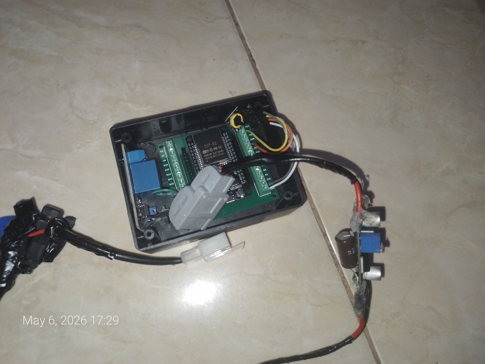
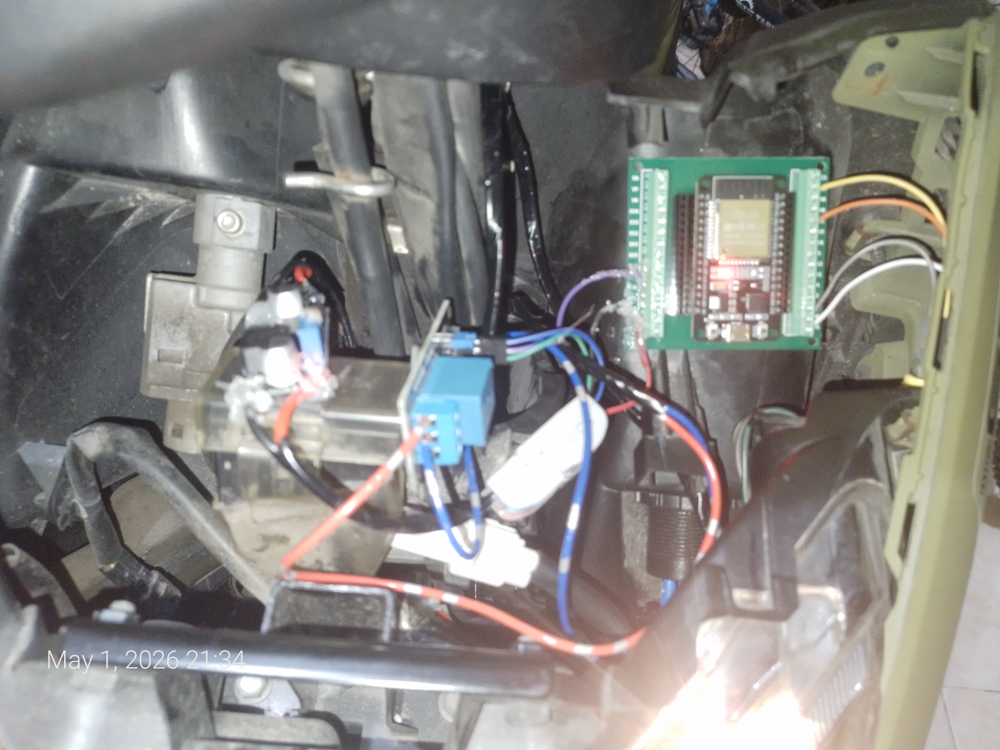

# 🏍️ Smart Key Motor Open Source (Kunci Motor)

Proyek *Smart Key* Motor berbasis IoT menggunakan mikrokontroler **ESP32** dan aplikasi mobile berbasis **React Native (TypeScript)**. Sistem ini dirancang dengan tingkat keamanan setara industri (*bank-grade security*) menggunakan enkripsi BLE tingkat lanjut (*Pairing/Bonding* dengan PIN Statis), Otentikasi Biometrik (Sidik Jari/Face ID), serta sistem validasi perintah *Challenge-Response* berbasis **SHA-256 (Proof of Work)** guna mencegah serangan penggandaan sinyal (*replay/sniffing attack*).

Proyek ini juga dilengkapi dengan modul **RTC (Real-Time Clock) DS3231** sebagai referensi waktu mandiri untuk mengaktifkan fitur *Time Bypass* (menyalakan motor otomatis selama jangka waktu tertentu yang ditentukan dari aplikasi).

---

## Hasil rakitan (setengah jadi/sebelum di finalisasi)
Maap kalo berantakan hehehe

|  |  |  |
| :---: | :---: | :---: |

---

## 📂 Struktur Folder Proyek

Berikut adalah peta struktur folder lengkap dari repositori ini agar Anda dapat melakukan navigasi kode dengan mudah:

```text
./
├── esp32/                              # Folder Firmware Microcontroller (C++)
│   └── sketch_apr29a_BLE.ino           # File utama kode Arduino untuk ESP32
│
└── App/                                # Folder Source Code Aplikasi Mobile (React Native)
    ├── android/                        # Konfigurasi proyek native untuk OS Android
    ├── ios/                            # Konfigurasi proyek native untuk OS iOS
    ├── src/                            # Source code logika aplikasi React Native
    │   └── components/                 # Komponen antarmuka (UI) modular:
    │       ├── AuthScreen.tsx          # Layar verifikasi Biometrik (Sidik Jari / PIN HP)
    │       ├── BypassCard.tsx          # Panel manajemen waktu bypass (aktif/nonaktif)
    │       ├── ConnectionScreen.tsx    # Layar tunggu saat proses scanning & koneksi BLE
    │       ├── EngineButton.tsx        # Tombol start/stop bulat virtual utama
    │       ├── Header.tsx              # Bar informasi status koneksi di bagian atas
    │       └── InfoCard.tsx            # Card informasi status keamanan enkripsi token
    ├── __tests__/                      # Unit testing aplikasi mobile
    ├── .bundle/                        # Konfigurasi bundler ruby untuk iOS dependency (Cocoapods)
    ├── App.tsx                         # Pengatur State utama dan Alur Navigasi Aplikasi
    ├── BLE.ts                          # Driver jembatan komunikasi Bluetooth & Kriptografi SHA-256
    ├── app.json                        # Metadata nama aplikasi mobile
    ├── package.json                    # Daftar dependensi modul Node.js (Yarn)
    ├── tsconfig.json                   # Konfigurasi compiler TypeScript
    └── yarn.lock                       # Pengunci versi paket dependency Node.js

```

---

## 🛠️ Daftar Komponen Hardware yang Diperlukan

| No | Nama Komponen | Spesifikasi rekomandasi | Fungsi Utama |
| --- | --- | --- | --- |
| 1 | **ESP32 Dev Board** | ESP32 WROOM-32 (30 atau 38 pin) | Otak pemroses data, enkripsi, dan pemancar sinyal Bluetooth BLE. |
| 2 | **Modul RTC DS3231** | DS3231 + Baterai CR2032 | Menyimpan waktu internal (jam & tanggal) yang tetap aktif meskipun motor mati. |
| 3 | **Modul Relay 5V** | Relay 1-Channel (Tipe **Active LOW**) | Bertindak sebagai sakelar elektronik untuk memutus/menyambung jalur pengaman motor. |
| 4 | **Buck Converter** | Tipe LM2596 atau Mini360 | Menurunkan tegangan Aki Motor (12V–14V) menjadi 5V stabil agar ESP32 tidak terbakar. |
| 5 | **Sekring (Fuse)** | Sekring Tancap (Blade Fuse) 2 Ampere + Soket | Pengaman arus lebih untuk mencegah korsleting pada kelistrikan motor. |

### Daftar komponen opsional
| No | Nama Komponen | Fungsi Utama |
| --- | --- | --- |
| 1 | **Box projek ukuran x3 (atau menyesuaikan)** | Wadah pelindung seluruh rangkaian elektronik agar aman dari debu dan guncangan. |
| 2 | **Terminal screw shield untuk esp32** | Mempermudah proses penyambungan kabel dari komponen luar ke pin ESP32 tanpa perlu menyolder langsung ke kaki mikrokontroler. |
| 3 | **Konektor kabel seperti konektor WAGO** | Memudahkan penyambungan kabel antar komponen tanpa perlu memuntir kabel secara manual, sehingga instalasi lebih rapi dan mudah dibongkar pasang. |
| 4 | **Posi-Tap atau T-Tap connector** | Konektor ini memungkinkan Anda untuk menyambung ke kabel motor yang sudah ada tanpa perlu memotong atau mengupas isolasi kabel aslinya |

---

## 🔌 Panduan Wiring (Koneksi Fisik & Elektrikal)

Perakitan hardware dibagi menjadi dua bagian: **Jalur Daya Utama (Power Sourcing)** dan **Jalur Pemutusan Relay (Engine Killer)**. Pilih opsi yang paling sesuai dengan kebutuhan keamanan dan kenyamanan Anda.

### 1. Opsi Jalur Daya Utama (Menyalakan ESP32)

#### **Opsi 1: Jalur Aki Langsung (Sistem Keyless Murni / Selalu Aktif)**

* **Kelebihan:** ESP32 menyala 24/7. Anda bisa menyalakan motor murni lewat HP tanpa perlu memutar kunci kontak fisik lagi.
* **Koneksi:** Sambungkan **IN+** Buck Converter langsung ke kutub **Positif (+) Aki** (wajib pasang sekring 2A) dan **IN-** ke **Negatif (-) Aki / Sasis**.

#### **Opsi 2: Jalur Kontak ACC / Soket Charger HP (Aktif Hanya Saat Kontak ON)**

* **Kelebihan:** Sangat aman, nol konsumsi daya aki saat motor mati (ESP32 ikut mati), memperpanjang umur modul. Berfungsi sebagai "Immobilizer Tambahan/Rahasia".
* **Koneksi:** 1. Cari kabel **Keluaran Kontak (ACC)** atau kabel **Positif (+) dari Soket Charger HP bawaan motor** (hanya bertegangan 12V jika kunci kontak diputar ke posisi ON).
2. Sambungkan kabel tersebut ke **IN+** Buck Converter.
3. Sambungkan **IN-** Buck Converter ke **Negatif (-) Aki / Sasis / Massa ground terdekat**.

---

### 2. Opsi Integrasi Relay (Sistem Pengaman)

#### **Opsi A: Memotong Kabel Kunci Kontak Main ACC (Rekomendasi Opsi Daya 1)**

Sistem ini memotong jalur utama kelistrikan motor. Motor hanya akan mendapat setrum jika diaktifkan via aplikasi.

* **Wiring:** Potong kabel *Keluaran Kontak (ACC)*. Sambungkan ujung kabel dari kunci kontak ke **COM Relay**, dan ujung kabel yang menuju mesin/ECU ke **NO Relay**.

#### **Opsi B: Memotong Kabel Standar Samping / Side Stand Switch (Sangat Direkomendasikan untuk Pemula)**

Sistem ini memanfaatkan fitur bawaan motor matic/sport di mana mesin akan mati jika standar samping diturunkan. Ini adalah jalur arus kecil sehingga sangat aman dari risiko korsleting besar.

* **Wiring:** 1. Temukan soket kabel yang berasal dari sakelar standar samping di dekat mesin bawah.
2. Potong salah satu dari dua kabel standar samping tersebut (biasanya kabel massa/ground menuju ECU).
3. Hubungkan **ujung potongan 1** ke terminal **COM Relay**.
4. Hubungkan **ujung potongan 2** ke terminal **NO Relay**.
* **Cara Kerja:** Meskipun standar samping sudah dinaikkan secara fisik, ECU mendeteksi standar seolah masih turun (mesin terkunci dan tidak bisa distarter) sampai Anda menekan tombol **START** di aplikasi untuk menutup *relay*.

---

### 3. Diagram Skema Teknis Komponen (ASCII)

```text
       ┌────────── [ PILIHAN SUMBER DAYA UTAMA 12V ] ──────────┐
       │                                                       │
  (Opsi 1: AKI 12V)                                   (Opsi 2: ACC / Soket Charger)
       │                                                       │
  [SEKRING 2A]                                                 │
       │                                                       │
       ▼                                                       ▼
┌──────────────┐                                        ┌──────────────┐
│  IN+ (+)    │              BUCK CONVERTER             │   IN- (-)    │
│              ├────────────────────────────────────────┤              │
│  OUT+ (+5V)  │        (Set Potensiometer ke 5.0V)      │  OUT- (GND)  │
└──────┬───────┘                                        └──────┬───────┘
       │                                                       │
       ├──────────────────────────────┐                        │
       │                              │                        │
       ▼ (5V)                         ▼ (5V)                   ▼
┌──────────────┐               ┌──────────────┐         ┌──────────────┐
│   VIN / 5V   │               │   VCC        │         │     GND      │
│              │               │              │         │              │
│   GPIO27     ├──────────────►│   IN (Sinyal)│         │              │
│              │               │              │         │              │
│   GPIO21     ├──────┐        └──────────────┘         │  GND ESP32   │
│   (SDA)      │      │             RELAY               │  GND RTC     │
│              │      │                                 │  GND Relay   │
│   GPIO22     ├─┐    │                                 └──────┬───────┘
└──────────────┘ │    │                                        │
     ESP32       │    │                                        │
                 │    ▼                                        │
                 │  ┌────┐                                     │
                 └──┼►SDA│                                     │
                    │    │             DS3231 RTC              │
                    │SCL ◄─────────────────────────────────────┘
                    └────┘

    [ TERMINAL RELAY ]
      ┌───────────┐
      │    COM    ├───────► [Potongan Kabel 1] Kunci Kontak ACC / Sakelar Standar Samping
      │           │
      │    NO     ├───────► [Potongan Kabel 2] Menuju Kelistrikan Motor / Massa ECU
      └───────────┘

```

---

## 🚀 Langkah 1: Setup & Upload Firmware ESP32 (`./esp32`)

### 1. Persiapan Arduino IDE & Board Manager

1. Unduh dan pasang [Arduino IDE](https://www.arduino.cc/en/software) versi terbaru.
2. Buka Arduino IDE, masuk ke menu **File** -> **Preferences**.
3. Pada kolom **Additional Boards Manager URLs**, masukkan tautan berikut:
`https://raw.githubusercontent.com/espressif/arduino-esp32/gh-pages/package_esp32_index.json`
4. Buka menu **Tools** -> **Board** -> **Boards Manager...**
5. Ketik `esp32` di kolom pencarian, pilih board buatan **Espressif Systems**, lalu klik **Install**.
6. Pasang Library RTC: Masuk ke **Sketch** -> **Include Library** -> **Manage Libraries...**, cari library bernama **RTClib** buatan **Adafruit**, lalu klik **Install** (pilih *Install All* jika meminta dependensi tambahan).

### 2. Kustomisasi Parameter Keamanan Wajib (Wajib Diganti!)

Agar motor Anda aman dan tidak dapat diakses oleh orang lain yang mengunduh repositori ini, Anda **harus membuat kode keamanan unik Anda sendiri**.

Buka file `./esp32/sketch_apr29a_BLE.ino` di Arduino IDE, lalu lakukan kustomisasi berikut:

* **Generate UUID Baru:**
Aplikasi ini menggunakan teknologi Bluetooth Low Energy (BLE). UUID bertindak sebagai pengenal jalur data komunikasi. Silakan buka situs web [uuidgenerator.net](https://www.uuidgenerator.net/) lalu buat 4 buah kode UUID versi 4 yang baru.
Ganti kode UUID bawaan pada baris paling atas dengan hasil generator Anda:
```cpp
#define SERVICE_UUID "MASUKKAN_UUID_BARU_1_DI_SINI"
#define ENGINE_SEND_CHARACTERISTIC_UUID "MASUKKAN_UUID_BARU_2_DI_SINI"
#define CHALLENGE_CHARACTERISTIC_UUID "MASUKKAN_UUID_BARU_3_DI_SINI"
#define TIMEBYPASS_CHARACTERISTIC_UUID "MASUKKAN_UUID_BARU_4_DI_SINI"

```


* **Ganti Static Passkey (PIN Pairing):**
Ubah kode PIN 6 digit berikut dengan PIN pilihan Anda sendiri. PIN ini wajib diinput saat HP Anda pertama kali melakukan enkripsi/bonding Bluetooth dengan motor Anda.
```cpp
uint32_t passkey = 123456; // GANTI dengan 6 digit angka rahasia Anda sendiri!

```


### 3. Langkah Upload Program

1. Sambungkan papan ESP32 ke komputer Anda menggunakan kabel data micro USB/Type-C berkualitas baik.
2. Di Arduino IDE, buka menu **Tools** -> **Board** -> **ESP32 Arduino** -> Pilih tipe board Anda (umumnya pilih **ESP32 Dev Module**).
3. Buka menu **Tools** -> **Port** -> Pilih port COM tempat ESP32 Anda terdeteksi.
4. Klik tombol **Upload** (ikon tanda panah kanan di bagian kiri atas).
5. Setelah upload selesai, buka **Serial Monitor** (**Tools** -> **Serial Monitor**) dan set baudrate ke **115200**.
6. Tekan tombol **EN/RST** pada ESP32 Anda. Serial monitor akan menampilkan inisialisasi sistem beserta **MAC Address Bluetooth** perangkat Anda (contoh: `B0:CB:D8:E8:6D:5A`). **Catat MAC Address ini!**

---

## 📱 Langkah 2: Setup & Install Aplikasi Mobile (`./App`)

Aplikasi ini dibuat menggunakan framework React Native berbasis TypeScript.

### 1. Instalasi Node Modules

1. Pastikan komputer Anda telah terinstal [Node.js](https://nodejs.org/) (Sangat direkomendasikan versi v22 ke atas).
2. Buka Terminal atau Command Prompt, arahkan masuk ke direktori `./App`:
```bash
cd App

```


3. Lakukan instalasi semua paket dependensi menggunakan `yarn` atau `npm`:
```bash
yarn install
# atau jika menggunakan npm: npm install

```


### 2. Kustomisasi Parameter Keamanan pada Aplikasi Mobile

Anda harus menyelaraskan data pengenal Bluetooth pada aplikasi agar cocok dengan parameter baru yang telah Anda upload ke ESP32.

Buka file `./App/BLE.ts` menggunakan teks editor pilihan Anda (misalnya VS Code), lalu ubah baris berikut:

* **Sematkan MAC Address ESP32 Anda:**
Ganti alamat MAC berikut dengan alamat MAC fisik ESP32 Anda yang sudah Anda catat dari Serial Monitor tadi:
```typescript
export const MAC_ADDRESS = 'B0:CB:D8:E8:6D:5A'.toUpperCase(); // Ubah ke MAC Address ESP32 Anda

```


* **Sematkan UUID Baru Anda:**
Ganti deretan UUID ini agar **sama persis** dengan 4 buah UUID baru yang sudah Anda buat dan tulis pada file program ESP32 sebelumnya:
```typescript
export const SERVICE_UUID = 'MASUKKAN_UUID_BARU_1_DI_SINI';
export const SEND_ENGINE_CHARACTERISTIC_UUID = 'MASUKKAN_UUID_BARU_2_DI_SINI';
export const CHALLENGE_CHARACTERISTIC_UUID = 'MASUKKAN_UUID_BARU_3_DI_SINI';
export const TIMEBYPASS_CHARACTERISTIC_UUID = 'MASUKKAN_UUID_BARU_4_DI_SINI';

```


### 3. Cara Menjalankan Aplikasi

Hubungkan handphone Android/iOS Anda ke komputer menggunakan kabel data dengan fitur *USB Debugging* aktif (untuk Android), atau jalankan emulator internal.

* **Untuk Pengguna OS Android:**
```bash
yarn android

```


* **Untuk Pengguna OS iOS (Membutuhkan Mac & Xcode):**
```bash
cd ios
pod install
cd ..
yarn ios

```


---

## 🔒 Pemahaman Sistem Keamanan Proyek

Proyek ini tidak sekadar mengirim sinyal "ON" atau "OFF" sederhana melalui Bluetooth (yang sangat rentan diduplikasi). Berikut alur kerja pengamanan berlapis yang aktif dalam sistem ini:

1. **Local Authentication (Biometrik):** Sebelum aplikasi dapat memproses pencarian Bluetooth, pengguna harus melewati pemindaian Sidik Jari/Face ID handphone pribadinya melalui modul `@sbaiahmed1/react-native-biometrics`.
2. **Bluetooth Secure Bonding:** Komunikasi data diamankan dengan enkripsi standar industri BLE. Saat pertama kali terkoneksi, sistem akan meminta input PIN statis 6 digit yang Anda buat di Arduino IDE, lalu menyimpan kunci enkripsi tersebut di dalam ruang memori aman sistem operasi handphone.
3. **SHA-256 Proof of Work (Anti-Replay Attack):**
* Saat Anda menekan tombol START/STOP, aplikasi tidak langsung mengirim perintah menyalakan motor.
* Aplikasi akan meminta kode acak dinamis (*Challenge*) yang digenerate oleh ESP32.
* Aplikasi harus memproses matematika kriptografi SHA-256 untuk menemukan angka penyerta (*Nonce*) sedemikian rupa sehingga hasil enkripsi *Challenge + Nonce* menghasilkan nilai hash berawalan angka nol sebanyak tiga kali (`000`).
* Setelah komputer handphone berhasil memecahkan teka-teki matematika tersebut, hasilnya dikirim kembali ke ESP32. Jika valid, ESP32 memberikan *One-Time Token* berdurasi pendek untuk mengubah status relay kontaktor.
* Dengan metode ini, peretas yang merekam lalu lintas sinyal Bluetooth tidak akan bisa menggunakan kembali rekaman perintah tersebut karena setiap perintah membutuhkan token yang selalu berubah di setiap detik.


---

## ⚠️ Disklaimer & Panduan Keselamatan

Modifikasi kelistrikan kendaraan bermotor memiliki risiko korsleting atau kerusakan sistem pengapian jika tidak dilakukan dengan hati-hati.

* Agar hasil pemasangan maksimal dan aman, rapihkan kabel dan sembunyikan seluruh alat di tempat yang sulit dijangkau (tersembunyi)
* Selalu pasang **Sekring (Fuse) Pengaman** pada kabel positif input Buck Converter guna mencegah potensi bahaya kebakaran bila terjadi kesalahan wiring.
* Lakukan uji coba fungsionalitas program terlebih dahulu di meja kerja (*breadboard*) menggunakan LED indikator sebelum melakukan pemotongan kabel kunci kontak motor asli Anda.

Selamat merakit! Jangan ragu untuk mengajukan kontribusi berupa *Issue* atau *Pull Request* bila Anda ingin menambahkan fitur baru pada proyek Smart Key open source ini.